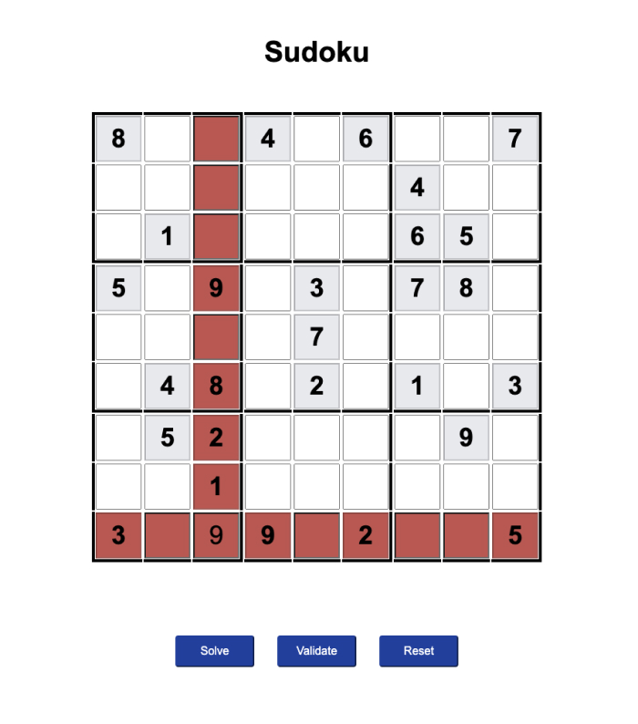

# Sudoku

This project is a playable client side Sudoku app.

Sudoku is played over a 9x9 grid, divided to 3x3 sub grids called "regions". The game begins with some of the grid cells already filled with numbers. The objective of Sudoku is to fill the other empty cells with numbers between 1 and 9 according to the following guidelines:

#### Sudoku Rules

* There can only be one number in each cell
* Numbers can appear only once on each row
* Numbers can appear only once on each column
* Numbers can appear only once on each 3x3 region

The app features the ability to reset the board back to its starting state, validate against rows and columns, and solve the puzzle if the current contents of the board are valid and it's solvable.

### Techology

This app has been built using vanilla JavaScript in order to showcase my understanding of the core concepts of the language.

### Installation

Nothing particular is required to run this app and it has no dependencies. It is currently only built to run locally.

### Approach

Although I am familiar with Sudoku puzzles, I decided to do some reading on the various [Sudoku solving algorithms](https://en.wikipedia.org/wiki/Sudoku_solving_algorithms) out there and I then opted to implement the backtracking algorithm.

Backtracking is an elegant way of brute forcing the solution. It iterates over all of the empty puzzle cells and beginning with 1, checks if the value is valid. It then moves to the next empty cell and repeats this. If at any point it exhausts all of the possible combinations in a cell it backtracks a loop, and increments the previous cell value, and begins again.

Backtracking relies on the use of recursion. A recursive function is a function that calls itself until a condition is met.

### User Interface

* The output in the browser is an editable Sudoku grid
* The grid cells already populated with numbers are not editable
* Blank cells are editable to users
* Users can only enter the numbers 1-9 in the inputs
* The solve button will solve the current state of the puzzle if it is solvable
* The validate button checks to see if the current state is valid and highlights any rows and columns that are invalid
* The reset button resets the board to its original starting state

### Things to improve on

Given some more time to work on this project, these are the things I would choose to improve:

* Architect the structure of the project to be better and use a JavaScript bundler (probably Parcel.js)
* Programatically generate the markup for the table intead of having lots of HTML with hardcoded IDs
* Work out how to validate against regions
* Build in the functionality to generate multiple new boards instead of working from a single hard-coded source
* Build some functionality to create different levels that would result in less numbers being included at the start of the game as the difficulty increases
* Refactor all of the JavaScript to make it DRY-er, for example, create a `findInvalid` function that would take in both rows and columns instead of having `findInvalidRows` and `findInvalidColumns`
* Write some tests to support testing the logic
* Work out a nicer way to give the user feedback if the board is not in a solvable state
* Spend a bit more time on the user interface and styles
